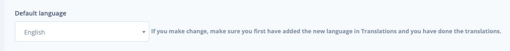
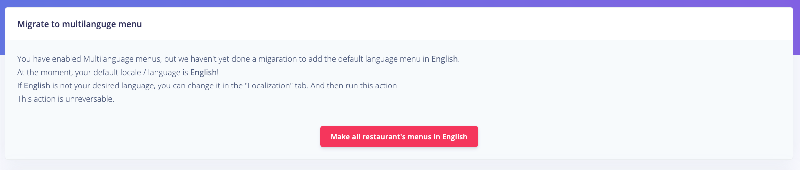

# Google Analytics

Visit [Google Analytics](https://analytics.google.com/) page.

On the left menu select **Admin**.



Click **Create Property**, **\*\*select** Web **and then** Continue.\*\*




After that it will appear screen with information for your website.

Fill it and then click **Create.**


After the tracking site tag is generated, copy only the code.


The copied code add in the .env file.

```text
GOOGLE_ANALYTICS=YOUR_CODE
```

After that you will be able to track your website.

